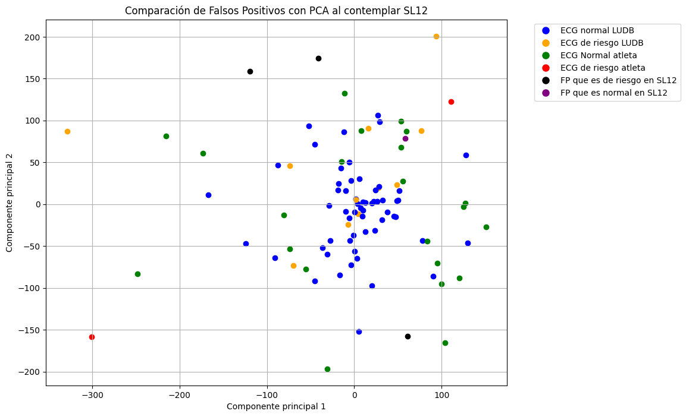

# Detección de riesgos cardíacos en deportistas

## Descripción del problema
Los deportistas de alto rendimiento generan adaptaciones en el corazón, derivando en un corazón de atleta. Estas adaptaciones pueden ser factores de riesgo para personas no deportistas, por lo que es importante detectar estas anomalías y evaluar si corresponde a un riesgo para el deportista. Debido a que un mal diagnóstico puede derivar en una muerte cardíca súbita.

Para solucionar este problema se plantea un modelo que busca predecir el diagnóstico general de un ECG de un deportista, se espera que **el modelo clasifique si se tiene un ECG normal o de riesgo**. Para así, alertar un posible riesgo y requerir la interpretación de un cardiólogo.

## Descripción de los datos
Se tiene la base de datos "Norwegian Endurance Athlete ECG Database"1 que contiene 28 ECG de 12 derivaciones de atletas de alto rendimiento de Noruega. Debido a la baja cantidad de datos se optó por expandir la cantidad de datos, para esto se usó “Lobachevsky University Electrocardiography Database”2.. Esta base de datos contiene 200 ECG de 12 derivaciones de personas que no son necesariamente deportistas, para utilizar estos datos en un contexto de detectar anomalías en deportistas, solo se considera los datos de los pacientes hasta 45 años, por lo que finalmente se tienen 69 pacientes de la nueva base de datos.

Las bases de datos tienen diferencias entre el formato de presentación del diagnóstico, pero en ambos casos **el diagnóstico es realizado por cardiólogos**, en el caso de la BD de Atletas Noruegos el cardiólogo es especializado en medicina deportiva, además, se tiene adicionalmente un diagnóstico del algoritmo Marquette SL12. En la BD de deportistas, las etiquetas se presentan en un listado, donde primero se indica el tipo de ritmo, posterior a esto se agregan si es que existen anomalías cardíacas, y finalmente se indica el diagnóstico general del ECG, si es normal, limítrofe o anormal. En el caso de la BD de Lobachevsky University, se indica el tipo de ritmo cardíaco, el eje eléctrico del corazón y se agregan si es que existen anomalías, en este caso no indica el diagnóstico general del ECG.

Para normalizar y estandarizar los datos de ambos ECG se hizo se normaliza los datos de los ECG ajustando los valores a un rango de 0 a 1 y luego ajusta la frecuencia de muestreo del ECG a 500 Hz. Si la frecuencia de muestreo original no es 500 Hz, realiza una interpolación para cambiar la frecuencia.

### Gráfico de hallazgos en la Base de Datos de Deportistas Noruegos

### Gráfico de hallazgos en la Base de Datos de Lobachevsky University

### Generación de diagnósticos de la nueva base de datos

Debido a que falta el diagnóstico general de cada ECG de la BD de Lobachevsky University, se evaluaron las etiquetas de los hallazgos en base al “Consenso Internacional de los Criterios para la Interpretación del ECG en Atletas”3. Estos criterios buscan disminuir los falsos positivos mejorando la detección de anomalías que pueden derivar en una muerte cardíaca súbita.
Los hallazgos se clasifican según el riesgo que presenta una de estas anomalías hacia los deportistas. 
Para los datos de Lobachevsky University, se tomó en cuenta las etiquetas presentes, en donde se clasificó como de riesgo una desviación del eje eléctrico del corazón, crecimiento en el auricular derecho o izquierdo y un bloqueo completo de la rama derecha o algún tipo de isquemia.

A continuación, se presentan las tablas que clasifica los hallazgos en habituales, borderline y anormales del "Consenso Internacional de los Criterios para la Interpretación del ECG en Atletas"

### Tabla 1: Hallazgos Habituales

### Tabla 2: Hallazgos Borderline

### Tabla 3: Hallazgos Anormales

### Gráficos de diagnósticos de los ECG 

Se presentan los diagnósticos generales de los ECG de ambas bases de datos.

### Gráfico de hallazgos en la Base de Datos de Deportistas Noruegos

### Gráfico de hallazgos en la Base de Datos de Lobachevsky University

### Gráfico PCA para visualizar ECG normales y de riesgo

Aunque no se puede diagnosticar  si un ECG es de riesgo mediante este gráfico, si se logra visualizar un sesgo entre la posición de los ECG y la clasificación, debido que hacia los bordes los casos se clasifican como de riesgo. Por lo que si existe una distancia que puede determinar si el ECG es de riesgo.

### Selección y Justificación de Modelos
Para predecir el diagnóstico general de un ECG, identificando si es **normal, o de riesgo** se utilizó el modelo de **K-nearest neighbors (KNN)** utilizando **Dynamic Time Warping (DTW)** como métrica de distancia, para así, comparar los ECGs y así encontrar el más cercano. 
Se utilizó esta técnica debido a la baja cantidad de datos, lo que dificultaba aplicar técnicas que requieren un mayor volumen de datos como Random Forest o algún algoritmo de aprendizaje supervisado.
Una de las principales ventajas de utilizar DTW en el análisis de ECGs, es su capacidad para alinear y comparar señales de diferentes longitudes o con variaciones en el tiempo. Para el caso de los ECGs, esto es útil debido a las siguientes razones.
Manejo de Variabilidad Temporal: Los ECGs suelen tener variaciones en la frecuencia y duración de los latidos cardíacos. DTW permite alinear estas señales, ignorando las pequeñas diferencias temporales, permitiendo detectar patrones de una mejor manera.
Eficiencia con Pocos Datos: Al no requerir grandes volúmenes de datos para entrenamiento, DTW se adapta de manera ideal para conjuntos de datos pequeños y permitiendo encontrar patrones relevantes.

Este modelo es relevante debido a que permite comparar las señales de ondas sin que afecte los pequeños desfases de tiempos, además al comparar señales permite comparar entre las formas de las ondas, detectando con precisión las similitudes entre las señales.

### Implementación y Evaluación de Modelos
El modelo de K-nearest neighbors (KNN) con Dynamic Time Warping (DTW) como métrica de distancia se entrena con la BD de Lobachevsky University. Para entrenar el modelo se utiliza la BD de Lobachevsky University, y para probar la precisión del modelo se utiliza la BD de Atletas Noruegos.
La implementación de KNN con DTW consiste en que, para cada ECG de la BD de Atletas Noruegos, se calcula las distancias DTW con respecto a cada ECG del conjunto de entrenamiento. Y con las distancias calculadas con respecto a todos los ECGs de entrenamiento, se buscan los 3 vecinos más cercanos, y si alguno de estos vecinos corresponde a un ECG de riesgo, el ECG evaluado se clasifica como de riesgo.

Al evaluar el modelo este entrega una exactitud del 85,71%, esto debido a que el modelo detecta los casos que son de riesgo, pero indica algunos falsos positivos, clasificando casos que son normales como de riesgos. Sin embargo, es importante que los casos de riesgo no sean detectados como normales.

#### Matriz de Confusión de Diagnósticos de ECGs de Atletas

Debido a que en este caso se generan ciertos falsos positivos, se presenta la opción de no clasificar este diagnóstico como un completo error, sino, que este caso posiblemente si necesite la evaluación de un cardiólogo de igual manera. Debido a que se posee las etiquetas del algoritmo SL12, se tiene la posibilidad de usar este diagnóstico para comprobar la predicción, cuando el modelo predice un ECG como de riesgo y el cardiólogo no lo contempló de esta manera, se evalúa el diagnóstico del algoritmo SL12. 

Al contemplar este diagnóstico adicional, se obtiene una exactitud del 96,4%, Debido a que el algoritmo SL12 había clasificados los ECG que dieron falsos positivos como de riesgo. Sin embargo, el cardiólogo al realizar un análisis del paciente descartó los riesgos. Por lo que el modelo no se aleja del diagnóstico final, ya que el objetivo del modelo es indicar si existe una alerta, para que así un cardiólogo pueda diagnosticar si es que existe un posible riesgo para el deportista.

#### Matriz de Confusión de Diagnósticos de ECGs de Atletas usando etiqueta de SL12

El recall es de 100% ya que se detectaron todos los casos de riesgo correctamente, lo que es primordial para el modelo. Adicionalmente, se tiene un 33,33% de precisión, ya que se generaron algunos falsos positivos, sin embargo, este porcentaje aumenta a 83.33% si se consideran los diagnósticos del SL12. 
EL F1 tiene un 50% considerando las etiquetas de los cardiólogos y un 90,91% considerando adicionalmente la etiqueta del SL12.

#### Métricas de la evaluación

### Comparación de gráfico PCA con predicciones realizadas

## Gráfico de etiquetas de cardiólogos

## Gráfico de etiquetas de predichas por el modelo

## Gráfico de etiquetas de cardiólogos

Se puede observar que los ECG de los bordes fueron detectados como de riesgo, ya que se acercan a ECGs que están clasificados como de riesgo. Sin embargo, según el cardiólogo, este corresponde a un ECG normal, lo que nos indica un falso positivo.

Al evaluar estos falsos positivos con las etiquetas de SL12, los clasificamos como, un FP con riesgo en etiqueta SL12 y un FP normal en SL12. 

## Conclusiones

Al realizar el entrenamiento del modelo KNN con DTW con la BD Lobachevsky University y las pruebas con la BD de Atletas Noruegos se obtuvieron resultados, el aspecto a destacar es que se predijeron todos los casos de riesgos. Esto es un aspecto importante, ya que es crucial no descartar ninguno de estos casos. Sin embargo, se generaron algunos falsos positivos, pero esto no es un total error, ya que como se demostró anteriormente la diferencia al usar del diagnóstico del algoritmo SL12, es posible que estos casos también necesitaban la evaluación de un cardiólogo para descartar los riesgos. 

Un aspecto negativo es el tiempo para diagnósticar un ECG, ya que aproximadamente se tiene un tiempo de ejecución para cada ECG de un minuto. Y al tener muchos datos que predecir el algoritmo, puede tardar en responder todo el conjunto

## Referencias

1. Singstad, B. (2022). Norwegian Endurance Athlete ECG Database (version 1.0.0). PhysioNet. https://doi.org/10.13026/qpjf-gk87.

2. 	Kalyakulina, A., Yusipov, I., Moskalenko, V., Nikolskiy, A., Kosonogov, K., Zolotykh, N., & Ivanchenko, M. (2021). Lobachevsky University Electrocardiography Database (version 1.0.1). PhysioNet. https://doi.org/10.13026/eegm-h675.

3. Drezner JA, Sharma S, Baggish A, et al. International criteria for electrocardiographic interpretation in athletes: Consensus statement. Br J Sports Med. 2017;51:704-731 
